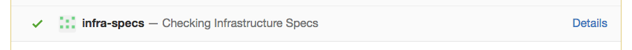

Infra Nagger
============

A Github webhook target to make our infrastructure spec status visible in our GitHub pull requests.

We constantly monitor our infrastructure health through automated testing. If at any time the infrastructure spec build is failing, we stop deploying until it is fixed. The Infra Nagger lets GitHub display the status of our infrastructure specs in all our pull requests, so that we notice failures at the time when we care most about them.

Installation
------------

Infra Nagger is a [webhook][webhooks] target for Github. You can create a new webhook for your repository using these settings:

- **Payload URL**: _https://rb-infra-nagger.herokuapp.com/pr-updated_
- **Content Type**: _application/json_
- **Which events would you like to trigger this webhook?**: _Pull Request_, _Pull request review comment_

Make sure your webhook is **active**!

Usage
-----

With these settings, the infrastructure specs status will be checked automatically everytime you **create a PR**, and everytime you **edit the first comment** of a PR.

For example, if you push to your PR when the infrastructure specs are broken, editing the first comment of the PR once they are fixed will give you the green light to merge and deploy your changes. That way, we get all the benefits of highly visible failures without slowing down our workflow while failures are being fixed.

  [webhooks]: https://developer.github.com/webhooks

Development
-----------

To be operational, Infra Nagger must be deployed to a server that can be accessed by Github webhooks. We currently use Heroku for this.

Credits
-------

[][redbubble]

Infra Nagger is maintained and funded by [Redbubble][redbubble].

  [redbubble]: https://www.redbubble.com

License
-------

    Infra Nagger
    Copyright (C) 2016 Redbubble

    All right reserved.
